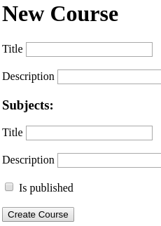

### Giriş

Nested formlar, önceden gördüğüm, ama pratikte hiç uygulamadığım bir konuydu.
Yakın zamanda, bulunduğum bir projede kullanma şansım oldu.
Uyguladıktan sonra gördüm ki, hem ortaya çıkan kod çok temiz oldu, hem de karşıma çıkmasından endişe ettiğim bir çok problem, kullandığım metodolojiden dolayı hiç var olamadı.
Sonuç olarak, hem kendim, hem de kafasını bir nebze de olsa açabileceğim insanlar için, bu yazıyı yazmaya karar verdim. Umarım keyifli bir yolculuk olur.

Hepimiz hazırsak, 'Course Management' isimli kurs yönetimi projemizi oluşturarak başlayalım:

```bash
rails new course_management
cd course_management
```

### Modellerin oluşturulması

İşimizi olabildiğince basit tutarak, iki adet model oluşturalım.
Bunlar Course ve Subject.
Kullanıcı kursu oluştuturken, kursun konularını da hızlıca eklemek isteyebilir.
Bu da bizi tam istedğimiz çıkmaza getiriyor.
`Daha oluşmamış Course modelimimz varken ona nasıl Subject ekleyebiliriz?`
Bu sorunun cevabını birazdan birlikte göreceğiz.
Şimdilik kendmizi bu konudan soyutlayıp modellerimizi oluşturalım.

```bash
rails g model Course title description:text
rails g model Subject course:references title description is_published:boolean
```

Modellerin aralarındaki işilkileri tanımlayıp, basit birkaç kontrol yazabiliriz:

```ruby
# app/models/course.rb
class Course < ApplicationRecord
  # Associations
  has_many :subjects, dependent: :destroy

  # Validations
  validates_presence_of :title, :description
end
```

```ruby
# app/models/subject.rb
class Subject < ApplicationRecord
  # Associations
  belongs_to :course

  # Validations
  validates_presence_of :title, :description
  validates :is_published, inclusion: { in: [true, false] }
end
```

Değişikliklerimizi veritabanımıza işlemeyi unutmayalım:

```bash
rails db:migrate
```

### Modellerin test edilmesi

Bu yazıyla pek alakası olmasa da, test yazmak yeterince önemsenmediği için bu başlığı buraya koymayı uygun gördüm.
Bir iki tane de olsa, test yazmak bize bir şey kaybettirmez.
Yinede, eğer isterseniz bu kısmı atlayabilirsiz.

```ruby
# test/models/course_test.rb
require 'test_helper'

class CourseTest < ActiveSupport::TestCase
  test 'course should be valid' do
    course = courses(:one)
    assert course
    course.subjects.delete_all
    assert course.valid?
  end

  test 'course should be invalid' do
    course = courses(:one)
    course.title = nil
    assert_not course.valid?
    course = courses(:two)
    course.description = nil
    assert_not course.valid?
  end
end
```

```ruby
# test/models/subject_test.rb
require 'test_helper'

class SubjectTest < ActiveSupport::TestCase
  test 'subject should be valid' do
    assert subjects(:one)
  end

  test 'subject should be invalid' do
    subject = subjects(:one)
    subject.title = nil
    assert_not subject.valid?
    subject = subjects(:two)
    subject.description = nil
    assert_not subject.valid?
  end

  test 'subject\'s is_published should be boolean' do
    subject = subjects(:one)
    subject.is_published = nil
    assert_not subject.valid?
    subject.is_published = false
    assert subject.valid?
  end

  test 'subject should have a course' do
    subject = Subject.new(title: 't', description: 'd', is_published: true)
    assert_not subject.valid?
    subject.course = courses(:one)
    assert subject.valid?
  end
end
```

Bundan sonra test komutumuzu çalıştırıp, modellerimizin istediğimiz gibi çalıştığından emin olabiliriz.

```bash
rails test
```

### accepts_nested_attributes_for kullanımı ve controllerın olışturuması

Artık asıl sorumuza geçebiliriz.
`Daha oluşmamış Course modelimimz varken ona nasıl Subject ekleyebiliriz?`
Bu sorunn cevabını rails bize [Building Complex Forms](https://guides.rubyonrails.org/form_helpers.html#building-complex-forms "Rails Guides") kısmında veriyor.
Birbirleri arasında one-to-one veya one-to-many ilişki bulunduran modeller arasında, iç içe geçmiş formlar kullanarak, aynı anda birden fazla işikili modeli oluşturabilir ve güncelleyebilir, hatta silebiliriz.
Şimdi biz de, burdaki işlemleri kendi senaryomuzda uygulayalım.
Öncelikle course modelimize, artık subject modeli için değerler alabilceğini söyleyelim:

```ruby
# app/models/course.rb
class Course < ApplicationRecord
  # Associations
  has_many :subjects, dependent: :destroy, inverse_of: :course
  accepts_nested_attributes_for :subjects

  # Validations
  validates_presence_of :title, :description
end
```

Burada eklediğimiz `accepts_nested_attributes_for :subjects` satırı bize, subject modeli için nested parametreler alabileceğimizi gösteriyor.
`inverse_of: :course` kısmı içinse basitçe, yaşayabilceğimiz karışıklıkları önlemek için bir önlem diyebiliriz.
inverse_of hakkında güzel bir örneği [Bi-directional Associations](https://guides.rubyonrails.org/association_basics.html#bi-directional-associations "Rails Guides") kısmında bulabilirsiniz.

Model kısmında işimiz bittiğine göre, controllerımızı oluşturarak işe başlayalım:

```ruby
# app/controllers/courses_contoller.rb
class CoursesController < ApplicationController
  before_action :set_course, only: %i[show edit update destroy]

  def index
    @courses = Course.includes(:subjects).all
  end

  def show; end

  def new
    @course = Course.new
    @course.subjects.build
  end

  def edit; end

  def create
    @course = Course.new(courses_params)
    if @course.save
      redirect_to courses_path(@course),
                  notice: 'Course was successfully created.'
    else
      render :new
    end
  end

  def update
    if @course.update(courses_params)
      redirect_to course_path(@course),
                  notice: 'Course was successfully updated.'
    else
      render :edit
    end
  end

  def destroy
    @course.destroy
    redirect_to courses_path,
                notice: 'Course was successfully destroyed.'
  end

  private

  def set_course
    @course = Course.includes(:subjects).find(params[:id])
  end

  def courses_params
    params.require(:course).permit(:title, :description, subjects_attributes: %i[id title description is_published])
  end
end
```

Görüldüğü gibi gayet standart bir controller.
Dikkatimizi vermemiz gereken iki tane kısım var:

* Parametrelerde subjects_attributes diye bir array alıyoruz (courses_params metodunda).
Arrayin içindeyse, tahmin edebileceğiniz gibi subjectin parametreleri var.

* New metodunun içinde `@course.subjects.build` satırı var.
Bu satır bize, course ile ilişkili bir şekilde oluştuacağımız subject için boş bir alan oluşturacaktır.
View'i oluştuturken bu alan üzerinden gideceğiz.

Son olarak routelerimizi girelim:

```ruby
# config/routes.rb
Rails.application.routes.draw do
  root 'courses#index'
  resources :courses
end
```

### Görünümlerin oluştutulması

Artık asıl sihirin oluştuğu kısımlara geçebiliriz.

İndex sayfamızda klasik olarak kurslarımızı listeliyoruz:

```erb
<!-- app/views/courses/index.html.erb -->
<h1>Courses</h1>
<% @courses.each do |course| %>
  <h2><%=course.title %></h2>
  <p><%=course.description %></p>
  <div>
    <% course.subjects.each do |subject| %>
      <h3><%= subject.title %></h3>
      <p><%= subject.description %></p>
      <p>published: <%= subject.is_published.to_s%></p>
    <% end %>
  </div>
<% end %>
<%= link_to 'new', new_course_path %>

```

New sayfamızda formumuza renderliyoruz:

```erb
<!-- app/views/courses/new.html.erb -->
<h1>New Course</h1>
<%= render 'form', course: @course %>
```

Formumuzda, her zaman yaptıklarımızdan hariç olarak; `form.fields_for` denilen metodu kullanacağız.
fields_for, parametre olarak verdiğimiz kaynak için, önceden aldığımız build kadar form üretmemizi sağlıyor.
Daha önceden controllerda kullandığımız `@course.subjects.build` satırı sayesinde, bir adet subject formu üretebileceğiz:

```erb
<!-- app/views/courses/_form.html.erb -->
<%= form_with(model: course, local: true) do |form| %>
  <% if course.errors.any? %>
    <% course.errors.full_messages.each do |message| %>
      <li><%= message %></li>
    <% end %>
    <br/>
  <% end %>
  <div class="form-group">
    <%= form.label :title %>
    <%= form.text_field :title %>
  </div><br/>
  <div class="form-group">
    <%= form.label :description %>
    <%= form.text_field :description %>
  </div>
  <h3>Subjects:</h3>
  <div class="field">
    <%= form.fields_for :subjects do |subjects_form| %>
      <%= render 'subjects_form', form: subjects_form %>
    <% end %>
  </div>
    <%= form.submit %>
<% end %>
```

Eğer `3.times { @course.subjects.build }` deseydik, üç adet subject formu oluşacağınada dikkat ediniz.

Son olarak, ayrı bir partial olarak konu formumuzu yazıyoruz:

```erb
<!-- app/views/courses/_subjects_form.html.erb -->
<div>
  <div class="form-group">
    <%= form.label :title %>
    <%= form.text_field :title %>
  </div><br/>
  <div class="form-group">
    <%= form.label :description %>
    <%= form.text_field :description %>
  </div><br/>
  <div class="form-check">
    <%= form.check_box :is_published %>
    <%= form.label :is_published %>
  </div><br/>
</div>
```

Artık aşağıdaki gibi mütevazı bir form görebiliriz.



Son olarak eksik kalan show ve edit sayfalarını da hızlıca bitirelim:

```erb
<!-- app/views/courses/show.html.erb -->
<h1><%=@course.title %></h1>
<p><%=@course.description %></p>
<div>
  <% @course.subjects.each do |subject| %>
    <h2><%= subject.title %></h2>
    <p><%= subject.description %></p>
    <p>published: <%= subject.is_published.to_s%></p>
  <% end %>
</div>
<%= link_to 'back', courses_path %>
<%= link_to 'edit', edit_course_path(@course) %>
```

```erb
<!-- app/views/courses/edit.html.erb -->
<h1>Edit Course</h1>
<%= render 'form', course: @course %>
<%= link_to 'back', courses_path %>
```

Evet artık nested formları tamamladık.
Konular için herhangi bir ek route ve controller kullanmadan işimizi oldukça basit bir şekilde hallettik.
Aynı zamanda kullanıcı, ek bir sayfaya gitmeden hızlıca işlemlerini tamamladı.
Yani hem koddan, hem de kullanıcı deneyiminden kazandık.

Şimdi işin biraz daha ayrıntılı kısımlarına girebiliriz:

### Nested formlarda silme işlemi
Silme işlemi de built-in olarak gelen çözümlerden bir tanesi.

İlk olarak kurs modelimize `allow_destroy: true` parametresini ekleyelim:

```ruby
# app/models/course.rb
class Course < ApplicationRecord
  # ...
  accepts_nested_attributes_for :subjects, allow_destroy: true
  #...
end
```

Daha sonra kulanıcının, konuyu silebilmesi için _destroy adında bir check_box ekleyelim.
Bu check_box işaretlenmiş olarak gelirse rails o kaydı bizim için silecektir.

```erb
<!-- app/views/courses/_subjects_form.html.erb -->
<div>
  <!-- ... -->
  <div class="form-check">
    <%= form.check_box :_destroy %>
    <%= form.label :_destroy %>
  </div><br/>
</div>
```

Son olarak controllerımızda _destroy parametresine izin verelim:

```ruby
# app/controllers/courses_contoller.rb
class CoursesController < ApplicationController
  # ...
  def courses_params
    params.require(:course).permit(:title, :description, subjects_attributes: %i[id title description is_published _destroy])
  end
end
```

Artık konularımızı da silebiliyoruz.
Konular derken şimdiye kadar hep bir adet konu üzerinden ilerledik.
Artık bu soruna dinamik bir çözüm getirmenin zamanı geldi.

### Dinamik Nested Forms

Rails, malesef bu kadar falza şeye destek verse de, `Adding Fields on the Fly` diye tabir ettiği şeye (yani dinamik olarak, client'da nested form oluşturmamıza) built-in bir çözüm sunmuyor.
Bizim senaryomuz için bu, forma koyacağımız bir `Konu Ekle` butonu demek.
Rails yinede bize bir çıkış noktasını [Rails Guides](https://guides.rubyonrails.org/form_helpers.html#adding-fields-on-the-fly "Rails Guides") 'da sunuyor.

Şimdi biz stimulus kullanarak yeniden kullanılabilir bir client çözümünü implemente edelim.

İlk olarak stimulusu kuralım:

```bash
bundle exec rails webpacker:install:stimulus
```

Konuların formunu gösterdiğimiz kısmı aşağıdaki gibi değiştirelim:

```erb
<!-- app/views/courses/_form.html.erb -->
<!-- ... -->
<div data-controller="nested-forms">
  <h3>Subjects:</h3>
  <div class="field">
    <%= form.fields_for :subjects do |subjects_form| %>
      <%= render 'subjects_form', form: subjects_form %>
    <% end %>
    <% subject_form = form.fields_for(:subjects,
                        Subject.new,
                        child_index: 'new_field') do |subject_form|
                          render('subjects_form', form: subject_form)
                        end %>
    <%= button_tag('Add Subject',
                    data: { action: 'nested-forms#add',
                            nested_forms_form: subject_form }) %>
  </div>
</div>
<!-- ... -->
```

Değiştirmek istediğimiz minimum alanı sarmalayan bir div oluşturduk ve `nested-forms` adını verdiğmiz bir stimulus controllerı verdik.

Ek olarak konu eklemek için bir button oluşturduk.
Şimdi stimulus controllerımızı yazalım:

```javascript
import { Controller } from 'stimulus'

export default class extends Controller {

    add(event) {
        event.preventDefault();
        let form = event.target.dataset.form;
        form = form.replace(/new_field/g, new Date().getTime().toString());
        event.target.insertAdjacentHTML('beforebegin', form);
    }
}
```

Burada da yaptığımız şey gayet kendini belli ediyor.
Tek dikkat etmemiz gerekn şey, form elemanlarının keylerinin unique olması.
Yeni render ettiğimizde `new_field` olarak gelen ksımları, o anki zamanla eşleştirerek unique olduklarından emin oluyoruz.
Tabiki burdaki unique yapma metodu iyileştirilebilir.
Ama bu haliyle oldukca iş göreceğini düşünüyorum.
Zaten server tarafında, id uygun bir şekiilde oluşturulacaktır.

Artık istediğimiz yapıya ulaştığımızı düşünüyorum.

### Sonuç

Nested formların muazzam şeyler olduklarına karar verdim.
Ama, her durumda kullanmak için kesinlikle uygun değil.

Mesela, konular kurslarda ortak kullanılan bir yapı olsaydı (arada join table ile), aşağıdaki gibi bir yapı daha mantıklı olurdu:

1. Kullanıcı kursu oluşturur.
2. Kursun edit sayfasında, (veya show) konuları insert eder (Ajax isteği atan `Ekle` butonları ile gerçekleştirilebilir.)

Bunun nested formlar ile yapılabilen hali, yukarıda gösterdğim alternatifi varken pek de mantıklı olmuyor :/

Ama yinede, kullanıcıdan kayıt sırasında adres almak, cevaplarıyla birlikte soru oluşturmak, varyasyonları ile birlikte ürün oluşturmak gibi akla gelebilecek bir çok alanda, hayatı kolaylaştıran bu özelliği aklımızın bir köşesinde tutmamızda fayda var.

Umarım keyifli bir yolculuk olmuştur. Eşlik ettiğiniz için teşekkür ederim.

**Düzenlenme süreci hala devam etmekte...**

**Kaynaklar eklenmeli...**
