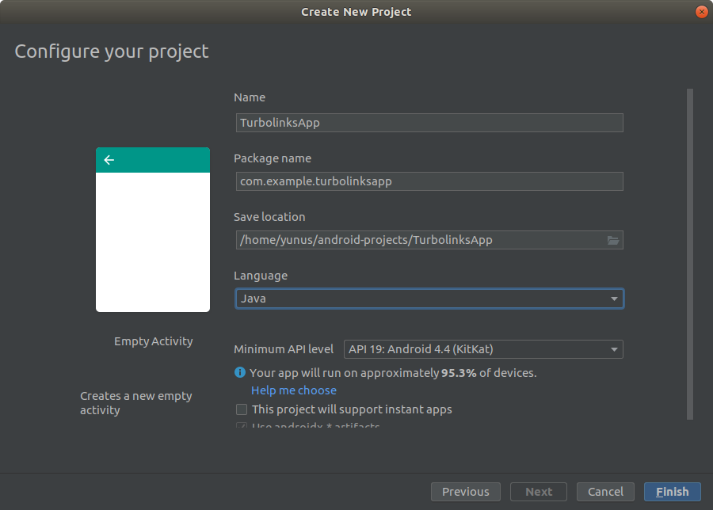

### Turbolinks ve Turbolinks Android Nedir?

<br/>

#### Turbolinks

Turbolinks, web'de gezinmeyi hızlandıran bir javascript kütüphanesidir.
Bunu, yeni bir linke gidildiğinde sadece body ve title'ı güncelleyerek yapar.
Rails ekosistemi için oldukça önemli bir yere sahiptir.

#### Turbolinks Android

Turbolinks'in bu davranışı sadece web'de değil, mobil uygulamalarda da performans artışı sağlar.
Web uygulama geliştiricileri, halihazırda geliştirmiş oldukları web sitelerini turbolinks adaptörleri sayesinde mobil cihazlara da uygulayabilirler.

Yani burda gelişmiş bir şekikde webview kullanan, hibrit uygulamalardan söz ediyoruz.

Şimdilik sadece [turbolinks-ios](https://github.com/turbolinks/turbolinks-ios) ve [turbolinks-android](https://github.com/turbolinks/turbolinks-android) adaptörleri bulunmaktadır.

**Turbolinks android adaptörü şu an geliştırilmemektedir. Geliştiricileri ise 2.0 versiyonunu hazırlamakta. [bknz.](https://github.com/turbolinks/turbolinks-android/issues/110#issuecomment-508091299)**

Şu an deprecate olması, işlevsel olmadığı anlamına gelmemekte bilakis Basecamp 3 uygulaması hala turbolinks-android ile çalışmaktadır.

### Hazırlık

#### Gereksinimler

* Sağlıklı bir rails geliştirme ortamı (rbenv, ruby, bundler, rails...)
* Android Studio

### Uygulamaların İlklendirilmesi

#### Rails Uygulaması

Konumuz rails olmadığı için bu kısmı fazla detay vermeden geçiyorum.
Rails 5 veya 6 kullanıyorsanız zaten turbolinks kullanıyorsunuz demektir (özellikle kaldırmadıysanız).
Onun haricinde, gerekli kurulum bilgilerini [turbolinks](https://github.com/turbolinks/turbolinks) reposunda bulabilirsiniz.
Ben bu yazıda MIT lisansıyla geliştirmekte olduğum basit [groupath](https://github.com/yunusemredilber/groupath) isimli projemi kullanacağım, çünkü işimiz sadece android tarafında olacak.

#### Android Projesi

İşe `Empty Activity`'i seçerek bir android projesi oluşturmakla başlayalım.


Projeyi oluştururken isim vermeyi ve **Minimum API Levelini 19 yapmayı** unutmayalım.
Turbolinks android adaptörü, android 4.4 öncesine destek vermemektedir.

> Ayrıca benim tavsiyem, eğer bu teknolojiyi seçecekseniz, min api sevyiesini 23 yapmanız olacaktır.



### Geliştirmeye başlama

Şimdi, yapılması oldukça basit olan aşağıdaki adımları, birer birer uygulayalım:

#### 1. Bağımlılıkları ayarlama

En büyük sıkıntıyı çektiğimiz kısım burası.
Çünkü zaman geçtikçe bağımlı uygulamalar değişiyor, farklı paketlere geçiyor veya siliniyor.
Bu yüzden bu adımın güncel olması gerekiyor. Bu yazıyı yayımladığım *2019-08-17* tarihi ile tüm bağımlılıklar çalışır halde ve günceldir.
Ayrıca güncel tutmaya çalışacağım.

`build.gradle` dosyamızdaki (uygulamanın, projenin değil!) bağımlılıklara (dependencies) eklememiz gereken üç _implementasyon_ var:

```gradle:title=build.gradle
implementation 'com.basecamp:turbolinks:1.0.9' // Turbolinks
implementation 'com.google.code.gson:gson:2.8.2' // Important addition 1
implementation 'org.apache.commons:commons-lang3:3.1' // Important addition 2
```

Dosyanın tam haline [bu gist](https://gist.github.com/yunusemredilber/e55ce3e00a18cf29ddfa6da4b6723044) üzerinden ulaşabilirsiniz.

Bundan sonra `Build > Rebuild Project` diyip *Build completed successfully* şeklinde bir çıktı almamız gerekiyor.

#### 2. activity_main.xml Ayarı

Bu dosyayı direkt orijinal turbolinks-android reposundaki örnek uygulamadan alabiliriz.

[activity_main.xml](https://github.com/turbolinks/turbolinks-android/blob/master/demoapp/src/main/res/layout/activity_main.xml)

```xml:title=app/res/layout/activity_main.xml
<?xml version="1.0" encoding="utf-8"?>
<LinearLayout
    xmlns:android="http://schemas.android.com/apk/res/android"
    android:layout_width="match_parent"
    android:layout_height="match_parent"
    android:orientation="vertical">

    <com.basecamp.turbolinks.TurbolinksView
        android:id="@+id/turbolinks_view"
        android:layout_width="match_parent"
        android:layout_height="match_parent"/>

</LinearLayout>
```
<br/>

#### 3. Internete erişim izini verme

Bunun için `AndroidManifest.xml` dosyasında, manifest tagının içine aşağıdaki satırı eklememiz yeterlidir.

```xml:title=app/manifests/AndroidManifest.xml
<uses-permission android:name="android.permission.INTERNET" />
```
<br/>

#### 4. MainActivity.java Ayarı

Bunun için de turbolinks-android reposundaki örnek uygulamayı baz alabiliriz.

[MainActivity.java](https://github.com/turbolinks/turbolinks-android/blob/master/demoapp/src/main/java/com/basecamp/turbolinks/demo/MainActivity.java)

> `app/ java/ com.example.turbolinksapp/ MainActivity.java`
> (com.example.turbolinksapp kısmı uygulamaya verdiğiniz isime göre değişebilir.)

> **En üstte bulunan `package com.example.turbolinksapp;` tarzı kodu, proje package isminiz farklıysa sizinkiyle değiştirin.**

118 satırlık kodu buraya yazmak mantıksız olacağından, kodu sadece örnek oluşturması amacıyla **kırparak** veriyorum. Lütfen [buradan](https://github.com/turbolinks/turbolinks-android/blob/master/demoapp/src/main/java/com/basecamp/turbolinks/demo/MainActivity.java) kopyalayarak kodunuzu düzenleyin.

```java:title=MainActivity.java
package com.example.turbolinksapp;

import android.content.Intent;
import android.os.Bundle;
// ...

public class MainActivity extends AppCompatActivity implements TurbolinksAdapter {
    
    private static final String BASE_URL = "http://10.0.1.100:9292";
    private static final String INTENT_URL = "intentUrl";

    private String location;
    private TurbolinksView turbolinksView;

    @Override
    protected void onCreate(Bundle savedInstanceState) {
        // ...
    }

    // ...
    
}

```
<br/>

#### 5. Turbolinks kullanan sitenizin adresini girin

Kısaca MainActivity classının BASE_URL değişkeninin değerini, uygulamanızın adresiyle değiştirin.

```java:title=MainActivity.java
public class MainActivity extends AppCompatActivity implements TurbolinksAdapter {
    // Change the BASE_URL to an address that your VM or device can hit.
    private static final String BASE_URL = "https://groupathx.herokuapp.com";
    private static final String INTENT_URL = "intentUrl";
    // ...
}
```

Başlangıçtada bahsettiğim gibi `groupath` uygulamamın adresini verdim.

Ve Sonuç :)


### Uygulamayı konfigüre etme

Turbolinks Android bize webviewin tam kontrolünü vermektedir. Bu webview'a `TurbolinksSession.getDefault(this).getWebView()` şeklinde ulaşabiliriz.


#### UserAgent 

Uygulamamıza özel user-agent setleyerek, daha farklı viewlar göstermek gibi uygulamaya özel işlemler yapabiliriz.
Buna en yaygın örnek, websitesinin navbarını render etmeyip, uygulama içinde native bir navigasyon göstermek olabilir.

```java:title=MainActivity.java
// Set UserAgent
TurbolinksSession.getDefault(this).getWebView().getSettings().setUserAgentString("MyAndroidApp");
```
<br/>

#### ProgressView

Sayfalar arası geçiş için gelen ProgressView ekranını özelleştirebiliyoruz. Bunun için aşağıdaki adımları takip edebilirsiniz:

##### 1. ActivityMain.xml Güncelleme

<br/>

```xml:title=app/res/layout/activity_main.xml
<?xml version="1.0" encoding="utf-8"?>
<LinearLayout
    xmlns:android="http://schemas.android.com/apk/res/android"
    android:layout_width="match_parent"
    android:layout_height="match_parent"
    android:orientation="vertical">

    <FrameLayout
        android:id="@+id/frameLayout"
        android:layout_width="fill_parent"
        android:layout_height="fill_parent"
        android:background="#fff">

        <ProgressBar
            android:id="@+id/indeterminateBar"
        />
    </FrameLayout>

    <com.basecamp.turbolinks.TurbolinksView
        android:id="@+id/turbolinks_view"
        android:layout_width="match_parent"
        android:layout_height="match_parent"/>


</LinearLayout>
```

Artık burada kullandığımız ProgressBar'ı istediğimiz gibi değiştirebiliriz.

##### 2. MainActivity.java Güncelleme

<br/>

```java:title=MainActivity.java, 
// ...

import android.view.View; // Add this line

public class MainActivity extends AppCompatActivity implements TurbolinksAdapter {
    // ...

    @Override
    protected void onCreate(Bundle savedInstanceState) {
        super.onCreate(savedInstanceState);
        
        // ...

        View progressView = (View) findViewById(R.id.frameLayout); // Add this line
        TurbolinksSession.getDefault(this)
                .activity(this)
                .adapter(this)
                .view(turbolinksView)
                .progressView(progressView, R.id.indeterminateBar, 500) // Add this line
                .visit(location);
    }

    // ...
}

```

Kullandığımız progressView methodundaki 500 parametresi, ms biçiminden progressBar'ın aktive edilme süresidir.

#### Hataları handle etme

MainActivity'deki handleError methodu ile hataları handle edebiliriz.
Hata oluştuğnda bu method, hata kodu ile birlite tetiklenir.
Örnek olarak internet yokken istek atıldığında bu method 0 koduyla tetiklenir.
Biz de kullanıcıya "internet bağlı değil" gibi native bir çıktı sunabiliriz.

#### Pathleri kotrol etme

Sayfada turbolinks'i aktif bir linke tıkladığımızda tetiklenen method `visitProposedToLocationWithAction` dır.
Artık biz de burada yeni bir intent üretip, gidilecek konumu vererek intenti başlatırız.

Ayrıca burada, gidilecek konumu kontrol etmek veya farklı bir aktiviteyi açmak gibi şeyler yapabiliriz.

> Android 9'da ngrok gibi bir servisle lokalden geliştirme yapmak isterken `Cleartext HTTP traffic not permitted` gibi çirkin bi hata ile karşılaşabilirsiniz.
> Bunu çözmek için **AndroidManifest.xml** dosyasındaki application tagına `android:usesCleartextTraffic="true"` attribute'ünü ekleyebilirsiniz.
> Production'da kullanmak tehlikeli olabileceği için işiniz bittiğinde silmeyi unutmayın.

### Daha komplike bir örnek

Daha komplike bir örnek için, kendi hazırladığım [groupath-android](https://github.com/yunusemredilber/groupath-android) projesine bakabilirsiniz.
Yeni şeyler öğrendikçe geliştiriyor olacağım.
